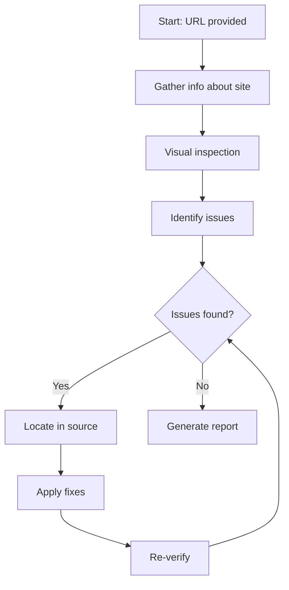
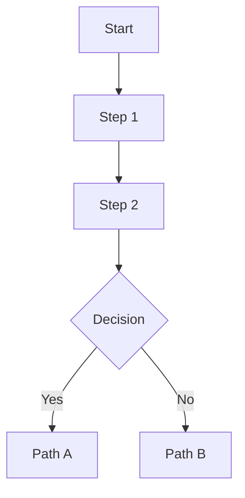

# How to Use Skills

A practical guide for implementing and leveraging advanced workflow modules (skills) to tackle complex development tasks.

## Overview

Skills are sophisticated workflow modules that combine instructions, prompts, and multi-step processes to handle complex, domain-specific tasks. Unlike simple prompts, skills often involve:

- Multiple file operations
- Interactive workflows
- External tool integration
- Visual inspection and validation
- Iterative refinement processes

## Table of Contents

- [Understanding Skills](#understanding-skills)
- [Available Skills](#available-skills)
- [Using Web Design Reviewer](#using-web-design-reviewer)
- [Using WebApp Testing](#using-webapp-testing)
- [Creating Custom Skills](#creating-custom-skills)
- [Best Practices](#best-practices)
- [Troubleshooting](#troubleshooting)

## Understanding Skills

### What is a Skill?

A skill is a specialized module that:

1. **Defines a specific capability**: Clear, focused purpose (e.g., "review web design", "test web apps")
2. **Includes prerequisites**: Requirements like running servers, installed tools, or available APIs
3. **Follows a workflow**: Multi-step process with decision points
4. **Provides guidelines**: Best practices and usage patterns
5. **Has supporting files**: Reference materials, helper scripts, or configuration templates

### Skill vs. Prompt vs. Instruction

| Feature | Instruction | Prompt | Skill |
|---------|-------------|--------|-------|
| **Complexity** | Simple guidelines | Single task | Multi-step workflow |
| **Automation** | Context-aware | One-time execution | Iterative process |
| **Prerequisites** | None | Minimal | May require tools/services |
| **Duration** | Always active | Seconds to minutes | Minutes to hours |
| **Example** | "Use TypeScript" | "Generate a test" | "Review entire UI for issues" |

### Skill Structure

```
skills/
└── skill-name/
    ├── SKILL.md           # Main skill definition
    ├── references/        # Supporting documentation
    │   └── guide.md
    └── helpers/          # Scripts and utilities
        └── helper.js
```

## Available Skills

### Web Design Reviewer

**Purpose**: Visual inspection and validation of website design quality

**Best for**:
- Finding layout issues
- Identifying accessibility problems
- Detecting responsive design breakage
- Validating visual consistency

**[View detailed guide →](#using-web-design-reviewer)**

### WebApp Testing

**Purpose**: Comprehensive testing and debugging of web applications using Playwright

**Best for**:
- Browser automation
- Form testing
- User flow validation
- Screenshot capture for debugging

**[View detailed guide →](#using-webapp-testing)**

## Using Web Design Reviewer

### Overview

The Web Design Reviewer skill enables AI-assisted visual inspection of websites, identifying design issues and performing source-level fixes.

### Prerequisites

Before using this skill:

1. **✅ Website must be running**
   ```bash
   # Start your development server
   npm run dev
   # or
   yarn dev
   ```

2. **✅ Browser automation available**
   - Playwright will be installed if needed
   - Ensure you can access the site in a browser

3. **✅ Source code access**
   - Project must be in the workspace
   - You need write permissions to fix issues

### When to Use

Use this skill when:
- 🎨 Launching a new design and want comprehensive review
- 🐛 Users report visual issues but you can't reproduce them
- 📱 Testing responsive design across breakpoints
- ♿ Validating accessibility compliance
- 🔄 After major CSS/design system changes

### Basic Usage

**Step 1: Trigger the skill**

```
@workspace Review the website design at http://localhost:3000
```

or more explicitly:

```
Use the web-design-reviewer skill to check http://localhost:3000 for design issues
```

**Step 2: Specify scope (optional)**

```
@workspace Review website design focusing on:
- Homepage layout
- Mobile responsiveness
- Color contrast for accessibility
- Typography consistency
```

**Step 3: AI performs review**

The skill will:
1. Navigate to your website
2. Capture screenshots at different viewport sizes
3. Analyze visual elements against best practices
4. Identify specific issues with locations
5. Suggest or implement fixes

### Workflow



### Example Session

```
You: @workspace Review the design at http://localhost:3000

AI: I'll review your website design. Starting visual inspection...

[Captures screenshots and analyzes]

AI: Found 5 design issues:

1. **Header logo misaligned** (src/components/Header.tsx)
   - Logo is 3px lower than navigation items
   - Fix: Adjust vertical alignment to center

2. **Button contrast too low** (src/styles/buttons.css)
   - Primary button has 2.8:1 contrast (needs 4.5:1)
   - Fix: Darken button color to #0052CC

3. **Mobile menu overflow** (src/components/MobileNav.tsx)
   - Menu items cut off on iPhone SE viewport
   - Fix: Add proper scrolling container

Shall I implement these fixes?

You: Yes, please fix all issues

AI: [Applies fixes and re-verifies]

All issues have been resolved. Summary:
- ✅ Header alignment corrected
- ✅ Button contrast improved to 6.2:1
- ✅ Mobile menu now scrolls properly

Would you like me to check for additional issues?
```

### Advanced Usage

**Check specific pages**:
```
@workspace Use web-design-reviewer to check these pages:
- http://localhost:3000/
- http://localhost:3000/products
- http://localhost:3000/checkout

Focus on consistent styling across pages
```

**Check specific breakpoints**:
```
@workspace Review responsive design at:
- Mobile: 375px width
- Tablet: 768px width
- Desktop: 1440px width
```

**Accessibility-focused review**:
```
@workspace Use web-design-reviewer with focus on WCAG 2.1 Level AA compliance:
- Color contrast
- Focus indicators
- Touch target sizes
- Screen reader compatibility
```

### Reference Files

The skill includes supporting documentation:

- **[visual-checklist.md](../skills/web-design-reviewer/references/visual-checklist.md)**: Comprehensive checklist of design issues to detect
- **[framework-fixes.md](../skills/web-design-reviewer/references/framework-fixes.md)**: Common fixes for popular frameworks

## Using WebApp Testing

### Overview

The WebApp Testing skill provides browser automation and testing capabilities using Playwright.

### Prerequisites

1. **✅ Node.js installed**
2. **✅ Web application running** (local or remote)
3. **✅ Playwright** (installed automatically if needed)

### When to Use

Use this skill when:
- 🧪 Testing user flows and interactions
- 🐞 Debugging frontend behavior
- 📸 Capturing screenshots for documentation
- 📋 Verifying form submissions
- 🔄 Testing dynamic content updates
- 📱 Checking responsive behavior

### Basic Usage

**Test a user flow**:
```
@workspace Use webapp-testing skill to test the login flow:

1. Navigate to http://localhost:3000/login
2. Fill username: testuser@example.com
3. Fill password: testpass123
4. Click submit button
5. Verify redirect to /dashboard
6. Verify welcome message appears
```

**Debug an issue**:
```
@workspace Use webapp-testing to debug checkout issue:

1. Go to http://localhost:3000/cart
2. Click "Proceed to checkout"
3. Capture screenshot
4. Show console logs
5. Report what happens
```

**Capture screenshots**:
```
@workspace Use webapp-testing to capture screenshots:

1. Homepage at desktop size
2. Products page at tablet size
3. Checkout at mobile size

Save to docs/screenshots/
```

### Example: Testing Form Submission

```javascript
// Example of what the skill does internally

// Navigate to form
await page.goto('http://localhost:3000/contact');

// Fill form fields
await page.fill('#name', 'John Doe');
await page.fill('#email', 'john@example.com');
await page.fill('#message', 'Test message');

// Submit
await page.click('button[type="submit"]');

// Verify success
await page.waitForSelector('.success-message');
const successText = await page.textContent('.success-message');
console.log('Success:', successText);

// Capture proof
await page.screenshot({ path: 'form-submitted.png' });
```

### Helper Scripts

The skill includes **[test-helper.js](../skills/webapp-testing/test-helper.js)** with utility functions:

```javascript
// Common test patterns
- waitForElement(selector, timeout)
- fillForm(formData)
- captureScreenshot(name)
- getConsoleLogs()
- checkAccessibility()
```

### Advanced Usage

**Test complete user journey**:
```
@workspace Use webapp-testing to test e-commerce flow:

1. Browse products
2. Add 3 items to cart
3. Apply discount code
4. Proceed to checkout
5. Fill shipping info
6. Complete payment (test mode)
7. Verify order confirmation

Capture screenshot at each step and report any errors.
```

**Performance testing**:
```
@workspace Use webapp-testing to check page performance:

Measure:
- Time to First Byte (TTFB)
- First Contentful Paint (FCP)
- Largest Contentful Paint (LCP)
- Cumulative Layout Shift (CLS)

For homepage at http://localhost:3000
```

## Creating Custom Skills

### When to Create a Skill

Create a custom skill when:
- You have a complex, multi-step workflow
- The task requires specialized tools or APIs
- You need iterative refinement (check → fix → recheck)
- The task is domain-specific to your organization
- You'll reuse this workflow frequently

### Skill Structure

**Step 1: Create skill directory**

```bash
mkdir -p skills/your-skill-name
cd skills/your-skill-name
```

**Step 2: Create SKILL.md**

```markdown
---
name: your-skill-name
description: 'Brief description of what this skill does and when to trigger it'
---

# Your Skill Name

Detailed explanation of the skill's purpose and capabilities.

## When to Use This Skill

Bullet list of scenarios where this skill is useful.

## Prerequisites

List of required:
- Tools (installed software)
- Services (running servers, APIs)
- Permissions (file access, API keys)
- Context (specific file structure)

## Core Capabilities

What this skill can do:
1. Capability 1
2. Capability 2
3. Capability 3

## Workflow Overview



## Usage Examples

### Example 1: Basic Usage
\`\`\`
Description and code
\`\`\`

### Example 2: Advanced Usage
\`\`\`
Description and code
\`\`\`

## Guidelines

1. Guideline 1
2. Guideline 2
3. Guideline 3

## Limitations

What this skill cannot do or situations it doesn't handle well.

## Related Resources

- Link to related documentation
- Link to helper files
```

**Step 3: Add supporting files**

```bash
# Reference documentation
mkdir -p references
touch references/detailed-guide.md

# Helper scripts
mkdir -p helpers
touch helpers/utility-script.js
```

**Step 4: Document usage**

Add your skill to:
- [Reference: Skills](reference-skills.md)
- Your project's documentation
- Team knowledge base

### Example Custom Skill: API Documentation Generator

```markdown
---
name: api-docs-generator
description: 'Generate comprehensive API documentation from OpenAPI specs and code comments'
---

# API Documentation Generator

Automatically generates complete API documentation by analyzing OpenAPI/Swagger specs and source code.

## When to Use This Skill

Use when you need to:
- Create or update API documentation
- Generate client SDK documentation
- Produce developer portal content
- Document REST or GraphQL APIs

## Prerequisites

- OpenAPI 3.0+ spec file
- API source code in workspace
- Documentation output directory

## Workflow

1. **Parse OpenAPI Spec**: Extract endpoints, parameters, responses
2. **Analyze Source Code**: Find implementation details and examples
3. **Generate Documentation**: Create markdown with examples and descriptions
4. **Validate**: Check for completeness and accuracy
5. **Format**: Apply consistent styling and structure

## Usage

\`\`\`
@workspace Use api-docs-generator skill

Input: openapi.yaml
Output: docs/api/
Include: code examples, authentication guides, error handling
\`\`\`
```

## Best Practices

### Start Simple

Begin with one skill and master it before adding more:
1. Learn web-design-reviewer first
2. Then add webapp-testing
3. Create custom skills as needs arise

### Combine with Instructions

Skills work better when combined with relevant instructions:

```
# Instructions provide context
.github/instructions/
├── frameworks/react/react.instructions.md
├── a11y.instructions.md

# Skills perform actions
skills/
└── web-design-reviewer/
```

### Automate Repetitive Checks

Use skills for tasks you do repeatedly:
- Pre-launch design reviews
- Post-deployment smoke tests
- Weekly accessibility audits
- Release candidate validation

### Document Custom Skills

For team-created skills:
1. Write clear usage examples
2. Document prerequisites explicitly
3. Include troubleshooting section
4. Provide example outputs
5. Keep reference materials updated

### Version Control Your Skills

Track skill changes like code:
```bash
git add skills/
git commit -m "Add custom API testing skill"
```

## Troubleshooting

### Problem: Skill Not Triggering

**Cause**: Trigger phrase not recognized

**Solution**: Be explicit about skill name:
```
# ❌ Vague
Check the website

# ✅ Explicit
Use web-design-reviewer skill to check http://localhost:3000
```

### Problem: Prerequisites Not Met

**Symptom**: Skill fails immediately

**Solution**: Check prerequisites:
```bash
# Is server running?
curl http://localhost:3000

# Is Playwright installed?
npx playwright --version

# Are files accessible?
ls -la src/components/
```

### Problem: Incomplete Results

**Cause**: Insufficient context or scope too broad

**Solution**: Narrow the focus:
```
# ❌ Too broad
Review everything

# ✅ Focused
Use web-design-reviewer to check homepage navigation and hero section only
```

### Problem: Skill Takes Too Long

**Cause**: Checking too many pages or configurations

**Solution**: Batch or prioritize:
```
# Check critical paths first
@workspace Use webapp-testing for:
- Login flow (priority 1)
- Checkout flow (priority 1)

# Then check secondary flows
@workspace Use webapp-testing for:
- Profile settings
- Search functionality
```

## Real-World Examples

### Pre-Launch Checklist

```bash
# 1. Visual review
@workspace Use web-design-reviewer on http://localhost:3000
Focus: accessibility, responsive design, browser compatibility

# 2. Functional testing
@workspace Use webapp-testing to verify:
- All user registration flows
- Payment processing
- Email verification
- Password reset

# 3. Performance check
@workspace Use webapp-testing to measure page load times

# 4. Generate report
@workspace Create launch readiness report from above findings
```

### Weekly Maintenance

```bash
# Monday: Visual audit
@workspace Use web-design-reviewer for weekly design audit

# Wednesday: Smoke tests
@workspace Use webapp-testing for critical path smoke tests

# Friday: Accessibility check
@workspace Use web-design-reviewer focusing on WCAG compliance
```

### Bug Investigation

```bash
# 1. Reproduce issue
@workspace Use webapp-testing to reproduce reported bug:
"Checkout button doesn't work on mobile"

# 2. Capture evidence
@workspace Take screenshots and console logs

# 3. Identify cause
@workspace Analyze captured data and identify issue

# 4. Implement fix
[Manual fix or prompt-generated fix]

# 5. Verify resolution
@workspace Use webapp-testing to confirm bug is fixed
```

## Related Resources

- **[Skills Reference](reference-skills.md)**: Complete catalog of available skills
- **[Web Design Reviewer Details](../skills/web-design-reviewer/SKILL.md)**: Full documentation
- **[WebApp Testing Details](../skills/webapp-testing/SKILL.md)**: Full documentation
- **[How to Use Prompts](how-to-use-prompts.md)**: Complement skills with prompts

## Next Steps

- **[Reference: All Skills](reference-skills.md)**: Browse the complete catalog
- **[Architecture & Philosophy](explanation-architecture.md)**: Understand the design principles
- **[Contributing](../CONTRIBUTING.md)**: Share your custom skills with the community

---

**Questions?** Check [GitHub Discussions](https://github.com/bpod/frontend-context-guidelines/discussions) or open an [issue](https://github.com/bpod/frontend-context-guidelines/issues).
