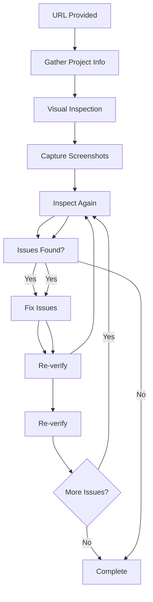

# Skills Reference

Complete catalog of all skills available in this repository with detailed documentation, workflows, and usage patterns.

## Overview

Skills are advanced workflow modules that combine instructions, prompts, and multi-step processes to handle complex tasks. This reference provides comprehensive information about each available skill.

## Quick Reference Table

| Skill | Purpose | Complexity | Prerequisites | Duration |
|-------|---------|------------|--------------|----------|
| [web-design-reviewer](#web-design-reviewer) | Visual design validation | ⭐⭐⭐⭐ | Browser automation | 5-30 min |
| [webapp-testing](#webapp-testing) | Browser automation & testing | ⭐⭐⭐ | Node.js, Playwright | Variable |

## Available Skills

---

## Web Design Reviewer

**File**: [skills/web-design-reviewer/SKILL.md](../skills/web-design-reviewer/SKILL.md)

### Overview

The Web Design Reviewer skill enables comprehensive visual inspection and validation of website design quality. It can automatically identify design issues and perform source-level fixes.

### Scope of Application

- Static sites (HTML/CSS/JS)
- SPA frameworks (React, Vue, Angular, Svelte)
- Full-stack frameworks (Next.js, Nuxt, SvelteKit)
- CMS platforms (WordPress, Drupal)
- Any web application accessible via browser

### When to Use

Use this skill when you need to:
- ✅ Find and fix layout issues
- ✅ Identify accessibility problems
- ✅ Detect responsive design breakage
- ✅ Validate visual consistency
- ✅ Check cross-browser compatibility
- ✅ Audit color contrast and typography
- ✅ Find CSS conflicts or overrides

### Prerequisites

**Required**:
1. Target website must be running (local or remote)
2. Browser automation available (Playwright)
3. Source code access (when making fixes)

**Optional but Recommended**:
- Design system documentation
- Figma/design files for reference
- WCAG compliance requirements

### Workflow Summary



### 2.2 Screenshot Capture

Capture screenshots at multiple viewport sizes:

| Device Type | Width | Use Case |
|-------------|-------|----------|
| Mobile (S) | 375px | iPhone SE |
| Mobile (M) | 390px | iPhone 12/13 |
| Tablet | 768px | iPad portrait |
| Desktop | 1440px | Standard desktop |
| Wide | 1920px | Large monitors |

### 2.3 Visual Checklist

For each viewport size, inspect for:

#### Layout Issues
- ❏ Content overflow / truncation
- ❏ Misalignment / inconsistent spacing
- ❏ Overlapping elements
- ❏ Broken grid or flex layouts
- ❌ Elements appearing outside viewport

#### Typography Issues
- [ ] Inconsistent font sizes
- [ ] Poor line height
- [ ] Text overflow or wrapping
- [ ] Unreadable font size (too small on mobile)

#### Color & Contrast
- [ ] Text contrast ratio meets WCAG (4.5:1 normal, 3:1 large)
- [ ] Consistent color palette usage
- [ ] Readability on all backgrounds

#### Layout & Spacing
- [ ] Proper margins and padding
- [ ] Alignment issues
- [ ] Overlapping elements
- [ ] Whitespace usage

#### Responsiveness
- [ ] Mobile layout (320px - 480px)
- [ ] Tablet layout (768px - 1024px)
- [ ] Desktop layout (1280px+)
- [ ] Content reflow and readability

#### Accessibility
- [ ] Color contrast meets WCAG AA
- [ ] Interactive elements have visible focus states
- [ ] Text is readable at all viewport sizes
- [ ] Touch targets are at least 44x44px

---

## Step 3: Issue Fixing Phase

Once design issues are identified, the skill must:

1. **Locate the Source**: Trace the visual issue back to the source file
2. **Propose Fix**: Explain the issue and suggest a solution
3. **Apply Fix**: Update the source code
4. **Validate Fix**: Re-check the page to verify resolution

### 3.1 Issue Prioritization

Issues should be prioritized by:

1. **Critical**: Functionality broken, accessibility violations (WCAG A)
2. **High**: Layout breaks, severe visual issues, WCAG AA violations
3. **Medium**: Minor visual inconsistencies, missing best practices
4. **Low**: Polish, nice-to-haves, subjective improvements

### 3.1 Identifying Root Cause

**Framework-Specific Approaches:**

- **React / Next.js** → Edit component JSX/TSX files
- **Vue** → Edit `.vue` single-file components
- **Angular** → Edit component `.ts` and `.scss` files
- **Static HTML** → Edit HTML + CSS files

### 3.2 Fix Implementation Best Practices

1. **Always minimize blast radius**
   - Edit only what is strictly necessary
   - Avoid refactoring unrelated code
   - Preserve existing functionality

2. **Prefer component-level fixes**
   - Fix at component level when possible
   - Only modify global styles when truly global

3. **Respect existing patterns**
   - If the project uses Tailwind, use Tailwind
   - If using styled-components, maintain consistency
   - Match naming conventions

4. **Test across viewports**
   - After fixing, re-verify across mobile / tablet / desktop

---

## Step 3: Issue Fixing

When a design issue is found:

1. **Locate Responsible File**
   - Identify the component or style file causing the issue
   - If unclear, use file search or grep

2. **Apply Appropriate Fix**
   - If styling uses **Tailwind**, fix className in the component
   - If using **CSS/SCSS**, edit the stylesheet
   - If CSS-in-JS, edit the inline or styled code

3. **Apply Minimal Changes**
   - Do not over-engineer or add extra features.
   - Use existing patterns from the project where possible.

4. **Testing the Fix**
   - After editing, re-run the site if necessary
   - Capture a new screenshot
   - Confirm the issue is resolved visually

---

## Step 3: Issue Fixing

When issues are discovered, follow this process for each issue:

### 3.1 Issue Identification and Prioritization

Create a prioritized list of issues:

| Priority | Severity | Type | Description |
|----------|----------|------|-------------|
| 🔴 Critical | Blocks core functionality | Layout broken, invisible text, key element missing |
| 🟡 Medium | Appearance or usability issue | Color contrast low, misalignment, inconsistent spacing |
| 🟢 Low | Minor cosmetic issue | Font size slightly off, minor spacing issue |

### 3.2 Root Cause Analysis

For each identified issue:

1. **Capture evidence**
   ```
   Screenshot: Show the issue visually
   Browser console: Check for errors or warnings
   Computed styles: Check actual applied CSS
   ```

2. **Hypothesize the cause**
   - Is it a CSS conflict?
   - Missing responsive breakpoint?
   - Framework-specific rendering issue?
   - Component prop mismatch?

3. **Locate the source**
   - Identify the component responsible
   - Find associated stylesheets
   - Check for conflicting styles

---

## Step 3: Issue Fixing Phase

### 3.1 Fix Order Priority

```
1. Critical issues        → Broken layout, illegible text
2. Accessibility issues   → Color contrast, missing labels
3. Responsive issues      → Mobile breakpoints
4. Visual polish          → Spacing, alignment tweaks
```

### 3.2 Finding the Source

**File Identification Strategy:**

| Framework | Component Location | Style Location |
|-----------|-------------------|----------------|
| React | `src/components/` | Inline, `*.css`, or styled-components |
| Next.js | `app/` or `pages/` | `globals.css`, Tailwind, CSS Modules |
| Vue | `src/components/` | `<style>` blocks or `*.vue` files |
| Angular | `src/app/` | `*.component.css` |
| Svelte | `src/` | `<style>` blocks in `*.svelte` |

**For Tailwind CSS:**

- Locate the component file (e.g., `Header.tsx`)
- Identify the element with the issue by class or structure
- Modify the `className` attribute directly

**For CSS/SCSS:**

- Use browser DevTools to identify the CSS selector
- Find the corresponding CSS/SCSS file
- Apply the fix

### 3.3 Making the Fix

After identifying the source:

1. **Explain the issue clearly** to the user
2. **Propose the fix** with before/after code
3. **Ask for confirmation** before applying
4. **Apply the change** using the edit tool
5. **Confirm the fix** was successful

---

## Step 3: Issue Fixing Phase

For each identified issue:

### 3.1 Issue Report Format

```markdown
## Issue #N: [Brief Description]

**Location:** [Component name / CSS file]
**Severity:** Critical | High | Medium | Low
**Category:** Layout | Typography | Color | Accessibility | Responsive

**Problem:**
[Clear description of what's wrong]

**Cause:**
[Technical explanation of why this is happening]

**Proposed Fix:**
[Code change needed]

**Impact:**
[What will change visually]
```

### 3.2 Fix Implementation

```
1. Show the current code
2. Show the proposed fix
3. Await user approval
4. Apply the change
5. Mark as ✅ fixed
```

### 3.3 Batch Fixes

For multiple similar issues (e.g., color contrast on all buttons):

- Group them together
- Propose a single systematic fix
- Apply to all instances

---

## Step 4: Re-verification Phase

After applying fixes:

1. **Reload the page** (if possible via screenshot or actual browser)
2. **Re-inspect** previously flagged areas
3. **Confirm fixes** are working as intended
4. **Identify any regressions** (new issues caused by fixes)
5. **Iterate** if necessary

---

## Completion Report

Once all issues are resolved, provide a summary:

```markdown
# Design Review Complete ✅

## Summary
- **Issues Found:** X
- **Issues Fixed:** Y
- **Remaining Issues:** Z

## Fixed Issues
1. ✅ Header alignment corrected
2. ✅ Button contrast improved
3. ✅ Mobile menu overflow resolved

## Remaining Issues (if any)
- [ ] Issue requiring manual review
- [ ] Issue blocked by missing asset

## Recommendations
- Run accessibility audit with Lighthouse
- Test on real devices
- Consider adding visual regression tests
```

---

## Best Practices

### Do's ✅

- Always capture screenshots before suggesting fixes
- Explain the "why" behind each issue
- Prioritize accessibility and usability over aesthetics
- Use semantic, user-facing language when describing issues
- Provide context-specific fixes for the user's framework
- Test fixes across multiple viewport sizes
- Document any assumptions made

### Don'ts ❌

- Don't make changes without user confirmation
- Don't assume the framework without checking
- Don't fix cosmetic issues before critical accessibility problems
- Don't use overly technical jargon without explanation
- Don't apply fixes that might break existing functionality
- Don't skip re-verification after applying changes

---

## Example Interaction

```
User: Review the design at http://localhost:3000

AI: I'll review your website design. Let me start by gathering information...

[AI detects Next.js + Tailwind from workspace]

Capturing screenshots at:
- Desktop (1920x1080)
- Tablet (768x1024)
- Mobile (375x667)

[After analysis]

I found 4 design issues:

1. **Header Logo Misalignment** (Medium)
   - Logo sits 3px lower than navigation items
   - Fix: Update flex alignment in Header.tsx

2. **Low Button Contrast** (High - Accessibility)
   - Primary button has 2.8:1 ratio (needs 4.5:1)
   - Fix: Darken button color in tailwind.config.js

3. **Mobile Menu Overflow** (High)
   - Menu items cut off on small screens
   - Fix: Add overflow-y-auto to MobileNav.tsx

4. **Inconsistent Spacing** (Low)
   - Padding varies between sections
   - Fix: Apply consistent spacing scale

Shall I proceed with fixing these issues?

User: Yes, fix all

AI: [Applies fixes one by one, showing diffs]

✅ All issues resolved. Re-checking...

[Re-verification complete]

All fixes verified. Your site now has:
- ✅ Proper alignment
- ✅ WCAG AA compliant contrast
- ✅ Working mobile menu
- ✅ Consistent spacing

Would you like me to check for additional issues?
```

---

## Limitations

- Cannot test in multiple browsers simultaneously (Chromium-based only via Playwright)
- Limited to visual issues detectable via screenshots and DOM inspection
- Cannot validate backend logic or API responses
- May miss issues that only appear under specific user interactions or data states
- Requires the website to be accessible (local dev server or public URL)

---

## Related Skills

- **Accessibility Auditor** – Deep dive into WCAG compliance
- **Performance Analyzer** – Check load times and optimization
- **Cross-Browser Tester** – Validate across Safari, Firefox, etc.

---

## Feedback Loop

After completing a review:

1. Ask the user if the review met their expectations
2. Offer to check additional pages or specific components
3. Suggest follow-up actions (e.g., Lighthouse audit, user testing)
````</output>
</result>
</function_calls>

<function_calls>
<invoke name="create_file">
<parameter name="content"># Skills Reference

Complete catalog of all skills available in this repository with detailed documentation, workflows, and usage patterns.

## Overview

Skills are advanced workflow modules that combine instructions, prompts, and multi-step processes to handle complex, domain-specific tasks. This reference provides comprehensive information about each skill including:
- **Purpose**: What the skill accomplishes
- **Prerequisites**: Requirements before using
- **Workflow**: Step-by-step process
- **Use cases**: When to apply the skill
- **Examples**: Real-world usage scenarios

## Available Skills

### Web Design Reviewer

**Location**: [skills/web-design-reviewer/](../skills/web-design-reviewer/)

**Purpose**: Visual inspection and validation of website design quality with automated issue detection and source-level fixes.

**Complexity**: ⭐⭐⭐⭐

**Best for**:
- Finding layout and alignment issues
- Identifying accessibility problems (WCAG compliance)
- Detecting responsive design breakage
- Validating visual consistency
- Pre-launch design reviews
- UI regression testing

**Prerequisites**:
- ✅ Website running (local dev server or deployed)
- ✅ Browser automation available (Playwright)
- ✅ Source code access in workspace
- ✅ Write permissions to fix issues

**Capabilities**:

1. **Multi-Viewport Testing**
   - Desktop (1920x1080)
   - Tablet (768x1024)
   - Mobile (375x667)
   - Custom viewport sizes

2. **Issue Detection**
   - Layout problems (alignment, spacing, overflow)
   - Typography issues (sizing, line height, readability)
   - Color contrast (WCAG 2.2 Level AA)
   - Responsive breakpoints
   - Accessibility violations
   - Visual inconsistencies

3. **Framework Support**
   - React, Vue, Angular, Svelte
   - Next.js, Nuxt, SvelteKit
   - Static HTML/CSS/JS

4. **Styling Method Support**
   - Pure CSS/SCSS
   - CSS Modules
   - Tailwind CSS
   - styled-components
   - Emotion
   - Other CSS-in-JS

**Workflow**:

```
Step 1: Information Gathering
├── URL confirmation
├── Framework detection
├── Styling method identification
└── Project structure analysis

Step 2: Visual Inspection
├── Capture screenshots (multiple viewports)
├── Analyze DOM structure
├── Compare against best practices
└── Identify issues with severity

Step 3: Issue Fixing
├── Locate source files
├── Propose fixes
├── Get user approval
└── Apply changes

Step 4: Re-verification
├── Reload page
├── Re-inspect fixed areas
├── Confirm resolution
└── Check for regressions

Step 5: Completion Report
└── Summary of fixes and recommendations
```

**Usage Example**:

```
@workspace Review the website design at http://localhost:3000

Focus on:
- Homepage layout
- Mobile responsiveness  
- Color contrast for accessibility
- Typography consistency
```

**Output**:
```markdown
Found 4 design issues:

1. Header Logo Misalignment (Medium)
   - Location: src/components/Header.tsx
   - Issue: Logo 3px lower than nav items
   - Fix: Update flex alignment

2. Low Button Contrast (High - Accessibility)
   - Location: tailwind.config.js
   - Issue: 2.8:1 contrast (needs 4.5:1)
   - Fix: Darken button color to #0052CC

3. Mobile Menu Overflow (High)
   - Location: src/components/MobileNav.tsx
   - Issue: Menu items cut off
   - Fix: Add overflow-y-auto

4. Inconsistent Spacing (Low)
   - Location: Multiple components
   - Issue: Varying padding
   - Fix: Apply consistent spacing scale

Shall I proceed with fixing these issues?
```

**Advanced Usage**:

**Specific page review**:
```
@workspace Use web-design-reviewer for:
- http://localhost:3000/
- http://localhost:3000/products
- http://localhost:3000/checkout

Check for consistent styling across pages
```

**Accessibility-focused**:
```
@workspace Use web-design-reviewer with WCAG 2.1 Level AA focus:
- Color contrast
- Focus indicators
- Touch target sizes
- Screen reader compatibility
```

**Reference Files**:
- [visual-checklist.md](../skills/web-design-reviewer/references/visual-checklist.md): Comprehensive checklist of design issues
- [framework-fixes.md](../skills/web-design-reviewer/references/framework-fixes.md): Framework-specific fix patterns

**Limitations**:
- Chromium-based browser only (via Playwright)
- Visual issues only (no backend testing)
- Requires accessible website URL
- May miss context-dependent issues

**Related Skills**: Accessibility Auditor, Performance Analyzer, Cross-Browser Tester (coming soon)

---

### WebApp Testing

**Location**: [skills/webapp-testing/](../skills/webapp-testing/)

**Purpose**: Comprehensive testing and debugging of web applications using Playwright automation.

**Complexity**: ⭐⭐⭐

**Best for**:
- Browser automation
- Form interaction testing
- User flow validation
- Screenshot capture for debugging
- Console log inspection
- Responsive behavior testing
- Integration testing

**Prerequisites**:
- ✅ Node.js installed
- ✅ Web application running (local or remote)
- ✅ Playwright (installed automatically if needed)

**Capabilities**:

1. **Browser Automation**
   - Navigate to URLs
   - Click buttons and links
   - Fill form fields
   - Select dropdowns
   - Handle dialogs and alerts
   - Manage authentication

2. **Verification**
   - Assert element presence
   - Verify text content
   - Check element visibility
   - Validate URLs and routes
   - Test responsive behavior

3. **Debugging**
   - Capture screenshots
   - View console logs
   - Inspect network requests
   - Debug failed interactions
   - Performance timing

4. **Test Patterns**
   - Page Object Model support
   - Data-driven testing
   - Parallel execution
   - Test fixtures

**Usage Examples**:

**Basic navigation test**:
```javascript
await page.goto('http://localhost:3000');
const title = await page.title();
console.log('Page title:', title);
```

**Form interaction**:
```javascript
await page.fill('#username', 'testuser');
await page.fill('#password', 'password123');
await page.click('button[type="submit"]');
await page.waitForURL('**/dashboard');
```

**Screenshot capture**:
```javascript
await page.screenshot({ 
  path: 'debug.png', 
  fullPage: true 
});
```

**Triggered Usage**:

```
@workspace Use webapp-testing skill to test the login flow:

1. Navigate to http://localhost:3000/login
2. Fill username: testuser@example.com
3. Fill password: testpass123
4. Click submit button
5. Verify redirect to /dashboard
6. Verify welcome message appears
```

**Debug a specific issue**:
```
@workspace Use webapp-testing to debug checkout issue:

1. Go to http://localhost:3000/cart
2. Click "Proceed to checkout"
3. Capture screenshot
4. Show console logs
5. Report what happens
```

**Capture screenshots for documentation**:
```
@workspace Use webapp-testing to capture screenshots:

1. Homepage at desktop size (1920x1080)
2. Products page at tablet size (768x1024)
3. Checkout at mobile size (375x667)

Save to docs/screenshots/
```

**Test complete user journey**:
```
@workspace Use webapp-testing to test e-commerce flow:

1. Browse products
2. Add 3 items to cart
3. Apply discount code "SAVE10"
4. Proceed to checkout
5. Fill shipping information
6. Complete payment (test mode)
7. Verify order confirmation

Capture screenshot at each step and report any errors.
```

**Guidelines**:

1. **Always verify app is running** – Check URL is accessible
2. **Use explicit waits** – Wait for elements/navigation
3. **Capture screenshots on failure** – Debug with visuals
4. **Clean up resources** – Close browser when done
5. **Handle timeouts gracefully** – Set reasonable timeouts
6. **Use semantic selectors** – Prefer data-testid or role-based

**Helper Scripts**:

The skill includes [test-helper.js](../skills/webapp-testing/test-helper.js) with utilities:

```javascript
// Common test patterns
- waitForElement(selector, timeout)
- fillForm(formData)
- captureScreenshot(name)
- getConsoleLogs()
- checkAccessibility()
```

**Common Patterns**:

**Wait for element**:
```javascript
await page.waitForSelector('#element-id', { 
  state: 'visible' 
});
```

**Check if element exists**:
```javascript
const exists = await page.locator('#element-id').count() > 0;
```

**Get console logs**:
```javascript
page.on('console', msg => 
  console.log('Browser log:', msg.text())
);
```

**Handle errors**:
```javascript
try {
  await page.click('#button');
} catch (error) {
  await page.screenshot({ path: 'error.png' });
  throw error;
}
```

**Limitations**:
- Requires Node.js environment
- Cannot test native mobile apps
- May have issues with complex authentication
- Some frameworks require specific configuration

**Related Skills**: E2E Test Generator, API Testing, Performance Testing (coming soon)

---

## Creating Custom Skills

### When to Create a Skill

Create a custom skill when you have:
- Complex, multi-step workflows
- Domain-specific requirements
- Interactive processes with decision points
- Need for specialized tool integration
- Repetitive tasks requiring consistency

### Skill Template

**Directory structure**:
```
skills/
└── your-skill-name/
    ├── SKILL.md              # Main skill definition
    ├── references/           # Supporting docs
    │   ├── guide.md
    │   └── checklist.md
    └── helpers/             # Scripts and utilities
        ├── helper.js
        └── config.json
```

**SKILL.md template**:
```markdown
---
name: your-skill-name
description: 'Brief description and trigger phrases'
---

# Your Skill Name

Detailed explanation of purpose and capabilities.

## When to Use This Skill

- Scenario 1
- Scenario 2
- Scenario 3

## Prerequisites

- Requirement 1
- Requirement 2
- Requirement 3

## Core Capabilities

### 1. Capability Name
Description

### 2. Capability Name
Description

## Usage Examples

### Example 1: Basic Usage
\`\`\`
Code or command
\`\`\`

### Example 2: Advanced Usage
\`\`\`
Code or command
\`\`\`

## Guidelines

1. Guideline 1
2. Guideline 2
3. Guideline 3

## Workflow

Step-by-step process description

## Limitations

What the skill cannot do

## Related Skills

Links to complementary skills
```

### Example Custom Skill: API Testing

```markdown
---
name: api-testing
description: 'Automated API testing with request validation, response verification, and performance monitoring'
---

# API Testing Skill

Comprehensive API testing including functional tests, contract validation, and performance checks.

## When to Use This Skill

- Testing REST/GraphQL APIs
- Validating API contracts
- Performance benchmarking
- Integration testing
- Regression testing

## Prerequisites

- API running (local or remote)
- OpenAPI/Swagger spec (optional)
- Authentication credentials (if required)

## Core Capabilities

### 1. Functional Testing
- Request/response validation
- Status code verification
- Header inspection
- Body parsing and validation

### 2. Contract Testing
- Schema validation
- Breaking change detection
- Backwards compatibility

### 3. Performance Testing
- Response time measurement
- Throughput testing
- Load testing

## Usage Example

\`\`\`
@workspace Use api-testing skill

Test: POST /api/users
Body: { "name": "John", "email": "john@example.com" }
Expected: 201 Created
Validate: User ID in response, email format correct
\`\`\`
```

## Skill Comparison Matrix

| Feature | Web Design Reviewer | WebApp Testing |
|---------|-------------------|----------------|
| **Primary Focus** | Visual quality | Functional testing |
| **Automation Level** | High | High |
| **User Interaction** | Moderate | Low |
| **Fix Application** | Yes | No |
| **Screenshot Capture** | Yes | Yes |
| **Multi-Viewport** | Yes | Yes |
| **Accessibility Focus** | Yes | Optional |
| **Performance Testing** | No | Optional |
| **Best for** | Design validation | User flow testing |

## Usage Best Practices

### 1. Choose the Right Skill

- **Visual issues** → Web Design Reviewer
- **Functional testing** → WebApp Testing
- **Both needed** → Use sequentially

### 2. Prepare Your Environment

- Ensure prerequisites are met
- Have URLs/credentials ready
- Clear browser cache if needed

### 3. Be Specific with Scope

```
❌ Vague: Check the website
✅ Specific: Use web-design-reviewer for homepage header, footer, and mobile menu
```

### 4. Iterate as Needed

Skills support iterative workflows:
```
1. Initial review
2. Fix high-priority issues
3. Re-review
4. Fix medium-priority issues
5. Final verification
```

### 5. Document Results

Save skill outputs for:
- Team review
- Future reference
- Regression testing
- Documentation

## Skill Workflows

### Pre-Launch Checklist

```bash
# 1. Visual review
@workspace Use web-design-reviewer on http://localhost:3000
Focus: accessibility, responsive, consistency

# 2. Functional testing
@workspace Use webapp-testing for critical flows:
- User registration
- Login/logout
- Purchase flow
- Profile updates

# 3. Generate report
Compile findings and create launch readiness document
```

### Bug Investigation

```bash
# 1. Reproduce with testing skill
@workspace Use webapp-testing to reproduce:
"Checkout button doesn't work on mobile"

# 2. Capture evidence
Screenshots, console logs, network traffic

# 3. Visual review for related issues
@workspace Use web-design-reviewer on checkout page

# 4. Fix and verify
Apply fixes, re-test with both skills
```

## Related Resources

- **[How to Use Skills](how-to-use-skills.md)**: Detailed usage guide
- **[Web Design Reviewer](../skills/web-design-reviewer/SKILL.md)**: Full documentation
- **[WebApp Testing](../skills/webapp-testing/SKILL.md)**: Full documentation
- **[Creating Custom Skills](how-to-use-skills.md#creating-custom-skills)**: Development guide

---

**Questions?** Check [GitHub Discussions](https://github.com/bpod/frontend-context-guidelines/discussions) or open an [issue](https://github.com/bpod/frontend-context-guidelines/issues).
